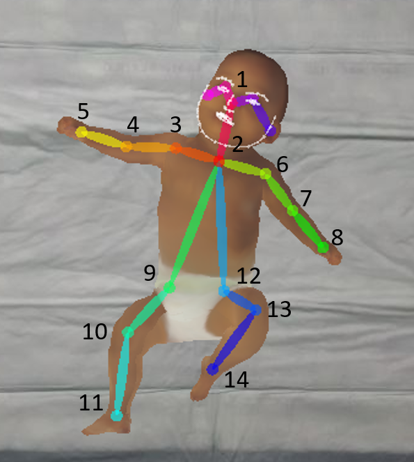

# SMARTBabies - Sensing Movement using Action Recognition Technology in Babies
The pursuit of early diagnosis of cerebral palsy has been an active research area with some very promising results using tools such as the General Movements Assessment (GMA). In this project, we explore the feasibility of extracting pose-based features from video sequences to automatically classify infant body movement into two categories, normal and abnormal. The classification was based upon the GMA, which was carried out on the video data by an independent expert reviewer. We explore the viability of using these pose-based feature sets for automated classification within a wide range of machine learning frameworks by carrying out extensive experiments.

# Requirements
In order to run this application, you must have:

* pytorch
* pandas
* numpy

# Getting started

The example program with detailed instructions can be found in main.py

All of the 5 models, namely FCNet, Conv1D-1, Conv1D-2, Conv2D-1, and Conv2D-2 are included in model.py

Samples of the HOJO2D and HOJD2D features can be found under data/

# Citation
Please cite these papers in your publications if it helps your research:

    @ARTICLE{McCay:DeepBaby,
      author={K. D. {McCay} and E. S. L. {Ho} and H. P. H. {Shum} and G. {Fehringer} and C. {Marcroft} and N. D. {Embleton}},
      journal={IEEE Access}, 
      title={Abnormal Infant Movements Classification With Deep Learning on Pose-Based Features}, 
      year={2020},
      volume={8},
      pages={51582-51592},
      doi={10.1109/ACCESS.2020.2980269}
    }
    
    @INPROCEEDINGS{McCay:PoseBaby,
       author={K. D. {McCay} and E. S. L. {Ho} and C. {Marcroft} and N. D. {Embleton}},
       booktitle={2019 41st Annual International Conference of the IEEE Engineering in Medicine and Biology Society (EMBC)},
       title={Establishing Pose Based Features Using Histograms for the Detection of Abnormal Infant Movements},
       year={2019},
       pages={5469-5472},
       doi={10.1109/EMBC.2019.8857680}
    }
         

# Authors and Contributors
SMARTBabies is developed by Kevin McCay (kevin.d.mccay@northumbria.ac.uk) and Edmond Ho (edmond@edho.net). Currently, it is being maintained by Edmond Ho.

# License
SMARTBabies is freely available for free non-commercial use, and may be redistributed under these conditions. Please, see the license for further details. Interested in a commercial license? Contact Edmond Ho (edmond@edho.net).
